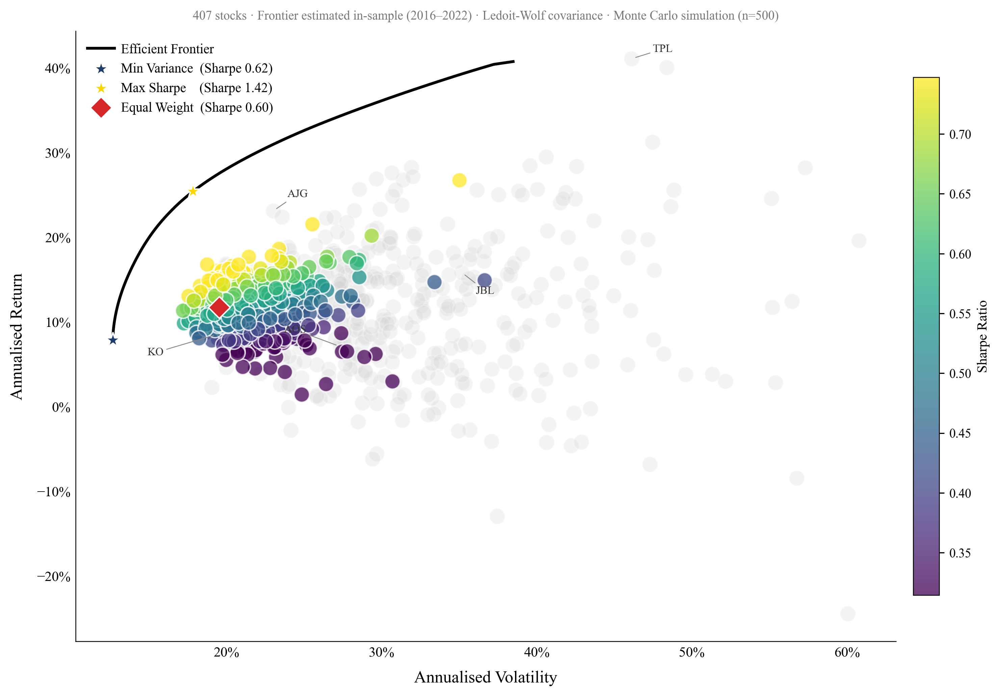
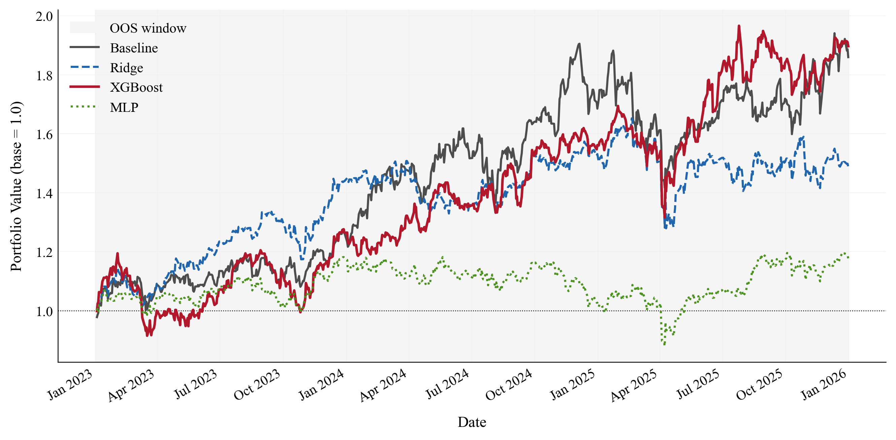
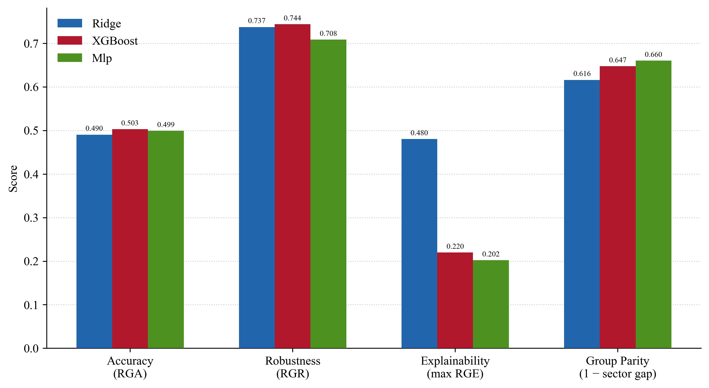
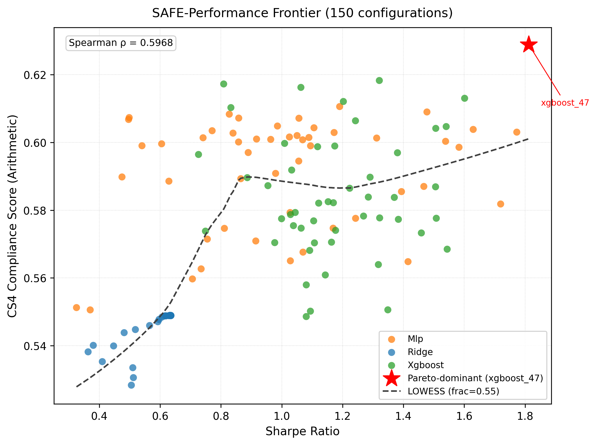

# Machine Learning in Portfolio Optimization under the SAFE AI Framework

**An Empirical Study of Expected Return Estimation**

Master's thesis in Finance — University of Pavia, Department of Economics and Management
Author: Anila Vata · Supervisor: Prof. Paolo Giudici · A.Y. 2025–2026

---

## Overview

This project asks two questions: can machine-learning-based expected return
estimates beat a simple historical-mean benchmark in out-of-sample portfolio
performance, and — if a model wins on performance — is it also the most
*responsible* model, in the sense defined by the **SAFE AI** framework
(Sustainable, Accurate, Fair, Explainable)?

Four return-estimation methods are compared inside the identical constrained
portfolio-optimization pipeline (same covariance estimator, constraints,
rebalancing rule, and transaction-cost assumptions):

- Historical Mean (benchmark)
- Ridge Regression
- Neural Network (MLP)
- XGBoost

Each model is scored on financial performance (Sharpe ratio, drawdown,
turnover, net-of-cost returns) **and** on SAFE AI compliance (robustness,
accuracy, fairness across GICS sectors, explainability), which are combined
into an **Integrated Compliance Score** and related to performance through the
**SAFE-Performance Frontier**.

**Headline result:** at the base risk-aversion level (λ = 1), XGBoost delivers
the highest gross and net Sharpe ratio and the highest SAFE AI compliance
score of the four estimators — but the edge is conditional: XGBoost only
leads at λ = 1 and 2, the Historical Mean is more competitive at other risk
tolerances, and higher turnover erodes most of the net-of-cost advantage.

| Estimator | Ann. Return | Volatility | Sharpe (gross) | Sharpe (net, 30bps) | Max DD | Avg. turnover |
|---|---|---|---|---|---|---|
| XGBoost | 21.60% | 23.98% | 0.90 | 0.78 | 23.41% | 78.2% |
| Historical Mean | 20.93% | 25.39% | 0.82 | 0.76 | 25.66% | 46.5% |
| Ridge | 13.39% | 21.76% | 0.62 | 0.48 | 22.58% | 79.9% |
| Neural Network | 5.45% | 18.04% | 0.30 | 0.12 | 25.57% | 93.2% |

At the aggregate level, SAFE AI compliance (CS4) correlates positively with
Sharpe ratio (ρ = 0.597 / 0.618 / 0.417 for arithmetic / geometric / RMS
aggregation, all p < 0.001) — the core SAFE-Performance Frontier result.
This relationship holds strongly within the Ridge family (ρ = 0.498,
p < 0.001) but is not statistically significant within XGBoost (ρ ≈ 0.09,
p = 0.54) or the Neural Network (ρ = 0.15, p = 0.29): part of the aggregate
pattern reflects differences *between* model families rather than within
them.

The empirical analysis uses a stock universe derived from the S&P 500
(Bloomberg data, 407 stocks after cleaning, Jan 2010–Dec 2025): a 2010–2015
warm-up, 2016–2022 in-sample training window, and a 2023–2025 out-of-sample
test period with 36 monthly expanding-window rebalances.

## Repository structure

```
.
├── Thesis_Anila_Vata.pdf                    # full thesis
├── Anila_Vata_Thesis_Defense_21_July_2026.pdf  # defense slides
└── tesi_SAFE_optimization/
    ├── run_pipeline.py                      # runs the full pipeline end to end
    ├── config.py                            # shared paths/constants
    ├── 1a_load.py                           # load raw Bloomberg data
    ├── 2a_preprocess.py                     # cleaning, universe construction
    ├── 3a_baseline.py / 3b-d_*.py            # historical-mean baseline + viz
    ├── 4a_features.py                       # feature engineering for ML models
    ├── 5a/b/c_*.py                           # Ridge / XGBoost / MLP training
    ├── 6a-f_*.py                             # portfolio construction & comparison
    ├── 7a-f_*.py                             # SAFE AI scalar metrics (RGA, RGE, RGR, RGF)
    ├── 8a-e_*.py                             # SAFE AI compliance vectors + Integrated Compliance Score
    ├── 9a/b_*.py                             # SAFE-Performance Frontier
    ├── 10a_appendix.py                       # appendix tables & figures
    ├── build_report.py / generate_report.py  # automated report generation
    ├── figures/                              # all generated charts, by pipeline step
    ├── outputs/step11/                       # appendix tables & figures
    └── data/
        ├── raw/        # Bloomberg source files — NOT included (license)
        ├── clean/      # cleaned/derived market data — NOT included (license)
        └── results/    # model outputs, metrics, compliance scores (included)
```

> **Data availability.** The raw and cleaned market data (`data/raw/`,
> `data/clean/`) are licensed from Bloomberg L.P. and are excluded from this
> repository (see `.gitignore`). What's included is all analysis code, the
> resulting metrics/figures, and the thesis documents themselves. To
> reproduce the pipeline you would need your own Bloomberg data pull matching
> the schema expected in `1a_load.py`.

## Methodology pipeline

1. **Data & preprocessing** — S&P 500-derived universe, prices/volume/market
   cap/total-return index from Bloomberg, cleaned and aligned (2010–2025).
2. **Baseline** — mean-variance optimization with historical mean returns,
   Ledoit-Wolf / OAS covariance shrinkage, transaction costs, turnover
   constraints.
3. **ML return estimation** — Ridge, XGBoost, and a small MLP trained on
   engineered features over an expanding in-sample window (2016–2022),
   re-estimated monthly and evaluated out-of-sample from 2023 to 2025.
4. **Portfolio construction** — same optimizer, constraints and rebalancing
   rule applied to each model's return forecasts; performance compared on
   Sharpe ratio, drawdown, turnover and net returns.
5. **SAFE AI assessment** — robustness (RGA/RGR), accuracy (RGE), fairness
   across GICS sectors (RGF), and explainability, aggregated into an
   Integrated Compliance Score per model.
6. **SAFE-Performance Frontier** — joint view of financial performance vs.
   compliance score across models and risk-aversion levels (λ).

## Selected results

| | |
|---|---|
|  |  |
|  |  |

## Tech stack

Python · pandas / numpy / scipy · scikit-learn · XGBoost · matplotlib ·
[`safeaipackage`](https://pypi.org/project/safeaipackage/) (SAFE AI metrics,
developed by Prof. Paolo Giudici's group) · python-docx / reportlab for
automated report generation.

## Reproducing the pipeline

```bash
cd tesi_SAFE_optimization
pip install -r ../requirements.txt
python run_pipeline.py
```

`run_pipeline.py` executes each step in order (data load → preprocessing →
baseline → ML models → portfolios → SAFE AI metrics → SAFE-Performance
Frontier) and logs timing for each stage. Note this requires the Bloomberg
data described above.

## Author

**Anila Vata** — Master's in Finance, University of Pavia
[anila.vata01@universitadipavia.it](mailto:anila.vata01@universitadipavia.it)
